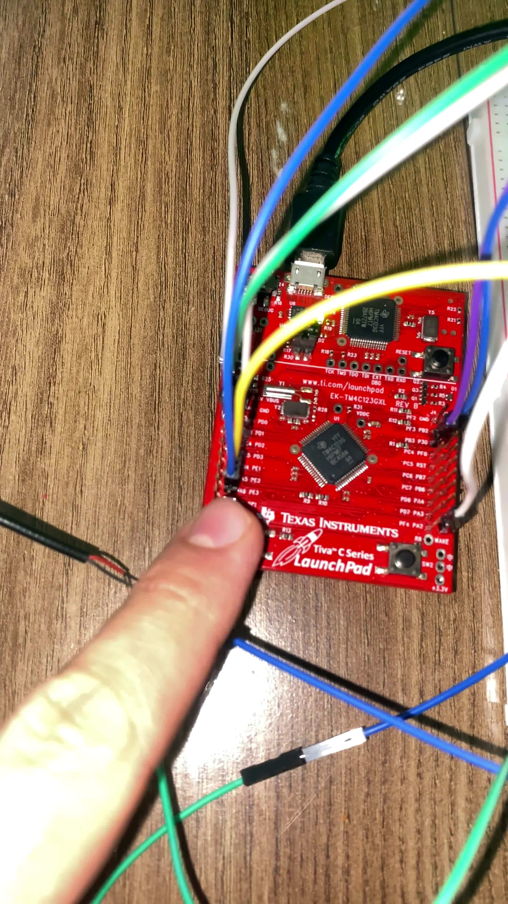
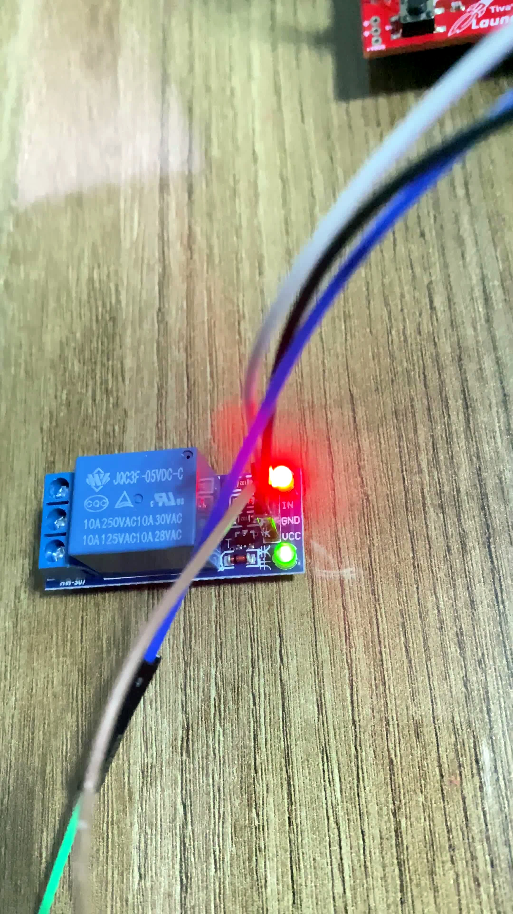
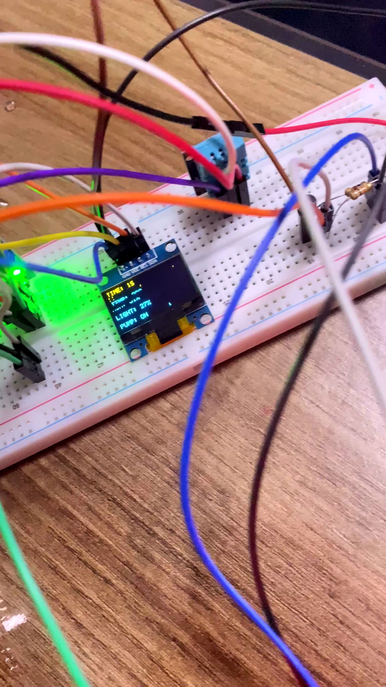

# TM4C123 Smart Irrigation System

A complete embedded smart-irrigation prototype built around the Texas Instruments **EK-TM4C123GXL Tiva C LaunchPad**. The project combines analog sensing, timing-sensitive digital sensing, I2C display output, UART diagnostics, relay/pump actuation, filtering, hysteresis, safety supervision, operator control, and motor-noise mitigation in one closed-loop system.

The repository is intentionally documented as an **engineering build record**, not only as a final showcase. It explains how the system is wired, how the firmware works, what failed during development, why each failure occurred, how it was corrected, and how the final behavior was verified.

<p align="center">
  
</p>

---

## 1. What the System Does

The controller continuously monitors:

- soil moisture through **PE3 / AIN0**
- ambient light through **PE2 / AIN1**
- temperature and humidity through a **DHT11 on PA2**
- operator START/STOP input through **SW1 / PF4**

It presents the current state on:

- an **SSD1306 OLED over I2C0**
- **UART0 at 115200 8N1**

When automatic control is enabled with SW1, the controller decides whether to run a DC water pump. The pump is not driven directly by the microcontroller. PB0 drives a **BC337 transistor interface**, which controls a relay that switches the pump power path.

### Final control behavior

```text
Power ON
   |
   v
System STOP
Sensors + OLED + UART active
Pump forced OFF
   |
SW1 pressed
   |
   v
System RUN
   |
   +-- Soil < 35% for 3 consecutive samples --> Pump ON
   |
   +-- Soil > 50% for 3 consecutive samples --> Pump OFF
   |
   +-- Pump reaches 20 s runtime -------------> SAFETY OFF
   |
Second SW1 press
   |
   v
System STOP + Pump OFF + state reset
```

The **35% start** and **50% stop** thresholds create hysteresis. The three-sample confirmation requirement prevents one disturbed ADC sample from immediately changing the pump state.

---

## 2. Repository Guide

| Resource | Purpose |
|---|---|
| [`source/main.c`](source/main.c) | Final readable application source |
| [`firmware/irrigation_system/`](firmware/irrigation_system/) | Importable Code Composer Studio project |
| [`docs/project-report.md`](docs/project-report.md) | Full engineering report |
| [`docs/hardware-connections.md`](docs/hardware-connections.md) | Final verified wiring |
| [`docs/build-and-run.md`](docs/build-and-run.md) | CCS import, build, flash and UART setup |
| [`docs/test-results.md`](docs/test-results.md) | Final verification results |
| [`docs/troubleshooting.md`](docs/troubleshooting.md) | Detailed problem → cause → fix history |
| [`docs/troubleshooting-audit.md`](docs/troubleshooting-audit.md) | Coverage check for all retained failures |
| [`docs/development-log.md`](docs/development-log.md) | Chronological development progression |
| [`docs/user-manual.md`](docs/user-manual.md) | Operating instructions |
| [`docs/media-evidence.md`](docs/media-evidence.md) | Engineering-claim-to-media mapping |
| [`docs/media-inventory.md`](docs/media-inventory.md) | Complete 99-image archive index |

The README deliberately uses only the strongest visual evidence. The full image archive remains available through the media inventory so the technical explanation does not collapse into a wall of photographs.

---

## 3. Hardware Used

### Controller and sensing

- EK-TM4C123GXL LaunchPad / TM4C123GH6PM
- resistive soil-moisture probe and analog interface module
- LDR photoresistor
- 10 kΩ resistor for the LDR divider
- DHT11 temperature/humidity sensor
- SSD1306 I2C OLED

### Pump and power stage

- DC water pump
- relay module
- BC337 NPN transistor
- 1 kΩ base resistor
- 10 kΩ relay-input pull-up resistor
- LM2596 buck converter
- 1N4007 diode
- 100 nF ceramic capacitor
- 470 µF electrolytic capacitor

<p align="center">
  
  
</p>

The final hardware is split into two physical sections because motor current and switching noise caused repeated problems when the sensitive electronics and pump circuitry were mixed into the same evolving breadboard layout.

---

## 4. Pin Assignment

| Function | TM4C123 pin | External connection |
|---|---|---|
| UART0 RX | PA0 | Stellaris Virtual Serial Port |
| UART0 TX | PA1 | Stellaris Virtual Serial Port |
| DHT11 data | PA2 | DHT11 S |
| Relay control | PB0 | 1 kΩ → BC337 Base |
| OLED SCL | PB2 / I2C0SCL | SSD1306 SCL |
| OLED SDA | PB3 / I2C0SDA | SSD1306 SDA |
| LDR analog input | PE2 / AIN1 | LDR divider midpoint |
| Soil analog input | PE3 / AIN0 | Soil sensor AO |
| User switch | PF4 / SW1 | Manual START/STOP |

---

# 5. Build the Hardware

The safest way to reproduce the prototype is to build and verify it in stages instead of wiring the entire system at once. That staged approach is important because several failures in this project became much harder to diagnose only after the motor was introduced.

## 5.1 Build the sensitive-electronics subsystem first

### OLED

```text
OLED GND -> Tiva GND
OLED VCC -> Tiva 3.3 V
OLED SCL -> PB2 / I2C0SCL
OLED SDA -> PB3 / I2C0SDA
```

The OLED address used by the firmware is:

```c
#define OLED_ADDRESS 0x3CU
```

<p align="center">
  
</p>

### DHT11

```text
DHT11 S -> PA2
DHT11 + -> Tiva 3.3 V
DHT11 - -> Tiva GND
```

### Soil-moisture sensor

```text
Soil VCC -> Tiva 3.3 V
Soil GND -> Tiva GND
Soil AO  -> PE3 / AIN0
Soil DO  -> not connected
```

Only the **analog output** is used.

<p align="center">
  
  
</p>

### LDR divider

```text
Tiva 3.3 V
   |
  LDR
   |
   +--------> PE2 / AIN1
   |
 10 kΩ
   |
  GND
```

The LDR, the PE2 jumper, and the upper side of the 10 kΩ resistor meet at the same midpoint node.

---

## 5.2 Build and test the relay driver without the pump

The relay was not left directly on the 3.3 V GPIO interface. The final verified driver is:

```text
PB0 -> 1 kΩ -> BC337 Base
BC337 Emitter -> LM2596 OUT-
BC337 Collector -> Relay IN
LM2596 OUT+ -> 10 kΩ -> Relay IN / Collector node
```

Relay supply:

```text
Relay VCC -> LM2596 OUT+
Relay GND -> LM2596 OUT-
Relay IN  -> BC337 Collector node
```

Why the resistors are there:

- **1 kΩ** limits BC337 base current.
- **10 kΩ** provides the relay-input pull-up used by the final driver arrangement.

<p align="center">
  
</p>

Before attaching the pump, verify that PB0 changes the relay LED/mechanical state repeatedly and that the transistor does not show abnormal heating.

---

## 5.3 Add the pump power path

Final relay-contact wiring:

```text
LM2596 OUT+ -> Relay COM
Relay NO    -> Pump +
Pump -      -> LM2596 OUT-
```

The **normally-open (NO)** contact is used deliberately. When the relay is inactive, the pump power path is physically open.

---

## 5.4 Add motor-noise suppression and supply filtering

### 1N4007 diode

```text
Striped end     -> Pump + / Relay NO side
Non-striped end -> Pump - / LM2596 OUT-
```

The stripe marks the diode cathode. It is reverse-biased during normal pump operation.

### 100 nF ceramic capacitor

```text
Pump + ---- 100 nF ---- Pump -
```

This capacitor is non-polarized and is placed across the motor terminals to suppress high-frequency motor noise.

### 470 µF electrolytic capacitor

```text
470 µF + -> LM2596 OUT+
470 µF - -> LM2596 OUT-
```

Observe capacitor polarity.

<p align="center">
  
  
  
</p>

---

## 5.5 Join the two subsystems with a controlled reference

The sensitive side and the power side still require a common electrical reference so the PB0 control signal is meaningful to the BC337 stage.

Final connection:

```text
Tiva GND -> LM2596 OUT-
```

The final rebuild intentionally avoided adding multiple unnecessary ground bridges between the two breadboards.

<p align="center">
  
</p>

---

## 5.6 Power-up checklist

Before applying power, verify all of the following:

- no direct short exists between LM2596 OUT+ and OUT-
- the 470 µF capacitor polarity is correct
- the 1N4007 stripe is on the pump-positive side
- relay **COM and NO** are used, not NC
- pump polarity is correct
- PB0 reaches the BC337 base only through the 1 kΩ resistor
- LM2596 OUT+ reaches Relay IN only through the 10 kΩ resistor
- the sensitive side and the power side share the intended single reference connection
- OLED, DHT11, soil sensor and LDR remain on the Tiva 3.3 V side

---

# 6. Firmware Architecture

The final application is contained in [`source/main.c`](source/main.c). The CCS project retains the original application filename `hello.c` so the tested project metadata remains importable. Both files contain the same final application code.

## 6.1 Main control constants

```c
#define MOISTURE_LOW_THRESHOLD   35U
#define MOISTURE_HIGH_THRESHOLD  50U
#define MAX_PUMP_RUNTIME         20U
#define ADC_SAMPLE_COUNT         16U
#define DRY_CONFIRM_COUNT         3U
#define WET_CONFIRM_COUNT         3U
#define SOIL_DRY_VALUE         4090U
#define SOIL_WET_VALUE         1650U
#define DHT_READ_INTERVAL_SECONDS 2U
#define DHT_MAX_RETRIES           3U
```

## 6.2 One-second scheduler

Timer0A generates a one-second timing event. The interrupt handler does very little work: it clears the interrupt and raises a flag. Sensor reads, display updates, UART output and pump decisions remain in the main context instead of running inside the ISR.

This keeps the interrupt handler short and makes the slower application logic easier to reason about.

## 6.3 ADC sequence and averaging

ADC0 sequencer 2 samples two analog channels:

```text
Sample 0 -> Soil sensor, PE3 / AIN0
Sample 1 -> LDR divider,  PE2 / AIN1
```

The firmware triggers the sequence **16 times** and averages both channels before percentage conversion. This was added because the pump produced short analog disturbances during development.

Averaging is then combined with confirmation counters. The design does not trust one filtered sample alone to start or stop the pump.

## 6.4 Soil calibration

Final calibration endpoints:

```c
#define SOIL_DRY_VALUE 4090U
#define SOIL_WET_VALUE 1650U
```

Conversion behavior:

```text
ADC >= 4090 -> 0%
ADC <= 1650 -> 100%
Intermediate values -> linearly mapped percentage
```

Values beyond the measured range are clamped so the displayed result stays within 0–100%.

## 6.5 Hysteresis and confirmation logic

### Dry condition

```text
Soil < 35%
```

The condition must remain true for **three consecutive control cycles** before the pump may start.

### Wet condition

```text
Soil > 50%
```

The condition must remain true for **three consecutive control cycles** before the pump stops normally.

### Hysteresis band

```text
35% <= Soil <= 50%
```

Inside this band, neither confirmation counter is allowed to accumulate. This prevents rapid switching when the measurement sits near a threshold.

## 6.6 Pump safety state

The 20-second runtime is a **backup safety mechanism**, not the normal stop target.

Normal stop:

```text
3 confirmed measurements above 50%
```

Safety stop:

```text
Pump has been continuously active for 20 s
```

When the runtime limit is reached, the pump is switched off and the controller enters a latched safety state until the system state is reset through the STOP/START sequence.

## 6.7 DHT11 reliability strategy

DHT11 communication is timing-sensitive. During pump integration, transient sensor errors appeared when the motor was active.

The final firmware therefore:

- retries DHT11 reads
- retains the most recent valid temperature/humidity values
- performs new DHT11 transactions only while the pump is OFF
- reads DHT11 less frequently than the analog channels

This prevents one disturbed read from immediately replacing valid display data with an error state.

## 6.8 SW1 operator control

PF4 uses the LaunchPad SW1 internal pull-up:

```text
Released -> HIGH
Pressed  -> LOW
```

The firmware uses edge detection and a short software debounce delay.

```text
Power-up     -> STOP, pump OFF
First press  -> RUN, reset control state, begin automatic evaluation
Second press -> STOP, pump OFF, reset runtime/counters/safety
```

The key point is that **monitoring starts immediately, irrigation does not**. This makes startup safer and makes demonstrations repeatable.

---

# 7. OLED and UART Output

The OLED presents:

```text
SOIL
TEMP
HUM
LIGHT
PUMP
TIME
```

Pump-state labels include:

```text
STOP
OFF
ON
SAFETY
```

<p align="center">
  
</p>

UART0 uses:

```text
Baud rate:    115200
Data bits:    8
Parity:       None
Stop bits:    1
Flow control: None
```

Example line:

```text
ADC:2695 | Soil:57% | Light:23% | System:RUN | Pump:OFF | Time:0s | Temp:29C | Hum:32%
```

UART became the main diagnostic channel during development because it allowed the controller state to be observed even when the OLED itself was corrupted or frozen.

---

# 8. Development Problems and How They Were Solved

This project did not reach the final configuration in one attempt. The table below summarizes **all major retained engineering problems** from the development history. The detailed chronology and screenshots are in [`docs/troubleshooting.md`](docs/troubleshooting.md).

| # | Problem / symptom | Cause or diagnostic conclusion | Final correction | How it was verified |
|---|---|---|---|---|
| 1 | Soil ADC values existed but the displayed percentage was not meaningful | A generic 0–4095 mapping did not represent the physical probe's dry/wet endpoints | Measured dry/wet endpoints were set to **4090 / 1650**, then clamped and mapped to 0–100% | Dry, wet and intermediate UART tests |
| 2 | Pump logic could become unstable around one threshold | No hysteresis existed | Split the decision into **35% start** and **50% stop** thresholds | Pump stopped chattering around one decision point |
| 3 | Relay did not behave reliably from the original direct GPIO arrangement | The 3.3 V GPIO was not treated as a clean direct interface to the relay-input stage | Added the **BC337 + 1 kΩ + 10 kΩ** interface | Relay LED, mechanical click and repeated switching matched PB0 state |
| 4 | Early BC337 tests failed and incorrect configurations caused abnormal transistor heating | Base/collector/emitter and resistor nodes were not yet wired in the final verified topology | Rebuilt the transistor stage and checked pin orientation before repowering | Repeated relay switching without abnormal transistor behavior |
| 5 | Relay clicked but the pump stayed silent or did not follow the intended normally-off behavior | Relay power contacts were wired incorrectly during early tests | Finalized `OUT+ -> COM`, `NO -> Pump+`, `Pump- -> OUT-` | Pump followed relay ON/OFF state correctly |
| 6 | Safety timeout behavior was being treated too much like a normal irrigation stop | Control intent was not yet separated into normal and emergency termination | Defined **wet confirmation as normal stop** and runtime limit only as fail-safe | UART distinguishes normal OFF from `SAFETY OFF` |
| 7 | Initial **10 s** safety timeout stopped the pump too early | Ten seconds was useful for bench testing but too restrictive for realistic wetting | Final timeout changed to **20 s** | System retained protection while allowing longer watering |
| 8 | Pump stopped/restarted after sudden soil-value jumps | Motor operation disturbed the analog measurement path | Added **16-sample ADC averaging** plus **3-sample dry/wet confirmation** | Single spikes no longer directly changed pump state |
| 9 | OLED showed corrupted text, missing lines and damaged content during pump operation | Motor startup/switching introduced electrical noise and supply disturbance into the sensitive I2C/display environment | Added diode, 100 nF motor capacitor, 470 µF bulk capacitor, physical separation and simplified grounding | Final rebuilt system maintained stable OLED output |
| 10 | DHT11 produced `TEMP: ERR` / invalid data around pump operation | Timing-sensitive DHT11 communication was vulnerable to disturbed electrical conditions | Added retries, retained last-valid values and skipped DHT reads while pump was active | Final display/UART retained valid environmental values more consistently |
| 11 | OLED froze at an old soil value while UART continued changing | MCU/control loop was still alive; failure was localized to OLED/I2C/power environment rather than total firmware crash | Used UART to isolate the fault, then fixed power/layout instead of treating it as a CPU crash | Final OLED resumed continuous updates after rebuild |
| 12 | Automatic I2C/OLED recovery experiment made behavior worse or failed to help | Root cause was primarily electrical, so aggressive software recovery only increased complexity | Removed the recovery experiment and returned to the simpler known-good I2C implementation | Simple implementation worked after electrical fixes |
| 13 | Some OLED labels/characters appeared incomplete | Custom 5x7 font did not contain every character introduced by intermediate UI text | Restricted strings to supported glyphs or added the required characters | Final `SOIL`, `TEMP`, `HUM`, `LIGHT`, `PUMP`, `STOP`, `ON`, `OFF`, `SAFETY`, `TIME` labels display correctly |
| 14 | CCS reported many duplicate function definitions and multiple `main()` errors | A complete revised source implementation had been pasted below the previous full implementation | Removed the duplicated half and restored one definition of every function and one `main()` | Duplicate-definition errors disappeared |
| 15 | A large compiler error cascade appeared after an earlier syntax problem | Parser context had already been lost, so later diagnostics were partly secondary symptoms | Fixed the earliest syntax/context problem first, then the true duplicate definitions | Project returned to a normal build state |
| 16 | OLED behavior improved when some redundant ground connections were removed | Pump current and sensitive return paths had become mixed through an increasingly complex breadboard ground network | Simplified the return-current structure and kept one deliberate shared reference between subsystems | OLED stability improved significantly |
| 17 | Incremental breadboard modifications became too difficult to reason about | Too many accumulated jumpers and shared paths made the remaining noise problem hard to isolate | Rebuilt the hardware from scratch as **two breadboards: sensitive + power** | Rebuilt system operated with stable OLED and correct pump behavior |
| 18 | Automatic irrigation started as soon as the board powered up | Original firmware enabled control immediately, reducing operator control and making demonstrations awkward | Added **SW1 / PF4 START-STOP** logic; startup now remains in STOP mode | Final demo can be started deliberately with one button press |
| 19 | A single successful subsystem test was not enough to prove the final system | Failures had appeared only when subsystems interacted | Defined a complete integrated test covering OLED, UART, DHT11, soil, LDR, relay, pump, timeout, SW1 and EMI behavior | Final integrated functional test passed |

### Representative failure evidence

<p align="center">
  
  
  
</p>

The central lesson from these failures was that the project was not only a firmware problem and not only a wiring problem. The final solution required **software filtering + state logic + power suppression + grounding changes + physical layout changes** working together.

---

# 9. Final Verification

The completed system was checked as one closed loop rather than as isolated modules.

## 9.1 Functional test summary

| Test | Final result |
|---|---|
| UART 115200 8N1 communication | Passed |
| OLED initialization and live refresh | Passed |
| DHT11 temperature / humidity | Passed |
| DHT retry + last-valid retention | Passed |
| Soil ADC response and calibrated percentage | Passed |
| LDR ADC response and light percentage | Passed |
| 16-sample ADC averaging | Passed |
| BC337 relay driver | Passed |
| Relay default-open pump path | Passed |
| Pump ON/OFF operation | Passed |
| Three-sample dry confirmation | Passed |
| Three-sample wet confirmation | Passed |
| 35% / 50% hysteresis | Passed |
| 20-second safety timeout | Passed |
| SW1 startup STOP state | Passed |
| SW1 RUN / STOP-reset behavior | Passed |
| Motor-noise mitigation | Passed |
| Two-subsystem integration | Passed |
| Common-ground reference | Passed |
| Real-soil irrigation response | Passed |

## 9.2 Normal closed-loop sequence

### Dry soil accepted → pump ON

<p align="center">
  
</p>

### Moisture rises → confirmed wet state → pump OFF

<p align="center">
  
</p>

### Safety fallback

If the wet threshold is not reached in time, the controller stops the pump at 20 seconds and enters the safety state.

<p align="center">
  
</p>

---

# 10. Video Validation

The repository contains seven optimized MP4 recordings. GitHub does not provide a dependable inline player for these normal committed video files, so the preview images below are clickable and open the corresponding raw MP4 directly.

<table>
<tr>
<td align="center" width="50%">
<a href="https://raw.githubusercontent.com/YigitalpDellal/TM4C123-Smart-Irrigation-System/main/videos/final-demo/01-final-irrigation-demo.mp4"></a><br>
<b>Final irrigation demonstration</b>
</td>
<td align="center" width="50%">
<a href="https://raw.githubusercontent.com/YigitalpDellal/TM4C123-Smart-Irrigation-System/main/videos/subsystem-tests/06-integrated-system-control-test.mp4"></a><br>
<b>Integrated system control test</b>
</td>
</tr>
<tr>
<td align="center" width="50%">
<a href="https://raw.githubusercontent.com/YigitalpDellal/TM4C123-Smart-Irrigation-System/main/videos/subsystem-tests/03-relay-driver-switching-test.mp4"></a><br>
<b>Relay-driver switching test</b>
</td>
<td align="center" width="50%">
<a href="https://raw.githubusercontent.com/YigitalpDellal/TM4C123-Smart-Irrigation-System/main/videos/subsystem-tests/04-pump-display-integration-test.mp4"></a><br>
<b>Pump and display integration test</b>
</td>
</tr>
</table>

Additional recordings:

- [Soil-moisture / water test](https://raw.githubusercontent.com/YigitalpDellal/TM4C123-Smart-Irrigation-System/main/videos/subsystem-tests/01-soil-moisture-water-test.mp4)
- [OLED and sensor subsystem test](https://raw.githubusercontent.com/YigitalpDellal/TM4C123-Smart-Irrigation-System/main/videos/subsystem-tests/02-oled-sensor-subsystem-test.mp4)
- [Sensitive-subsystem soil test](https://raw.githubusercontent.com/YigitalpDellal/TM4C123-Smart-Irrigation-System/main/videos/subsystem-tests/05-sensitive-subsystem-soil-test.mp4)

For every retained photograph and video-derived frame, see [`docs/media-inventory.md`](docs/media-inventory.md).

---

# 11. Build and Run in Code Composer Studio

Development environment used by the project:

- Code Composer Studio
- TivaWare for C Series 2.2.0.295
- TI ARM Compiler 20.2.7.LTS
- Stellaris ICDI debug interface
- PuTTY or another serial terminal

The original project references the TivaWare installation path used on the development machine:

```text
C:/ti/TivaWare_C_Series-2.2.0.295/
```

If TivaWare is installed elsewhere, update the CCS include/library paths.

### Import

```text
File
-> Import
-> CCS Projects
-> select firmware/irrigation_system/
```

### Build

```text
Project -> Build Project
```

Generated `Debug/`, object, binary and map outputs are intentionally not tracked in Git.

### Flash / debug

Connect the LaunchPad through the DEBUG USB connector, then use the normal CCS debug/flash workflow.

### Serial terminal

```text
115200 baud
8 data bits
no parity
1 stop bit
no flow control
```

Full instructions: [`docs/build-and-run.md`](docs/build-and-run.md).

---

# 12. Recommended Reproduction and Test Order

A student or engineer reproducing the project should verify one layer at a time:

1. **LaunchPad + UART**: confirm stable serial output.
2. **OLED only**: verify initialization and I2C updates.
3. **DHT11**: verify temperature/humidity values.
4. **LDR**: observe ADC/light percentage under two illumination conditions.
5. **Soil sensor**: record dry, intermediate and wet values; confirm the supplied calibration is appropriate for the actual probe/soil.
6. **Relay driver without pump**: verify BC337/relay switching repeatedly.
7. **Pump contact path**: confirm COM/NO wiring and default pump-off behavior.
8. **Add suppression components**: diode, 100 nF and 470 µF.
9. **Connect the common reference** between sensitive and power subsystems.
10. **Run dry-confirmation test**: pump must not start from only one low sample.
11. **Run wet-confirmation test**: pump must stop normally after three accepted wet samples.
12. **Run safety test**: if the wet target is not reached, pump must stop at 20 s.
13. **Run SW1 test**: startup STOP, first press RUN, second press STOP/reset.
14. **Run full motor/noise test** while watching both OLED and UART.
15. **Run the real-soil closed-loop test** with the irrigation outlet positioned away from the probe so the probe measures soil wetting rather than a direct water stream.

This sequence mirrors the debugging logic that ultimately made the prototype stable.

---

# 13. Design Decisions and Why They Exist

| Design choice | Reason |
|---|---|
| 35% start / 50% stop | Adds hysteresis and prevents threshold chatter |
| Three consecutive samples | Rejects isolated ADC disturbances |
| 16-sample ADC average | Reduces short analog spikes |
| BC337 relay interface | Provides a controlled interface between PB0 and relay input stage |
| Relay NO contact | Keeps pump physically disconnected when relay is inactive |
| 20 s maximum runtime | Prevents unlimited pump operation if wet threshold is not reached |
| DHT11 read deferral while pump runs | Avoids timing-sensitive transactions during the noisiest operating state |
| Last-valid DHT data | Prevents transient failures from immediately destroying useful display data |
| SW1 manual enable | Makes startup predictable and gives the operator explicit control |
| Diode + 100 nF + 470 µF | Reduces motor/power disturbances |
| Two-breadboard architecture | Separates sensitive electronics from the high-current/noisy pump stage |
| One deliberate common reference | Keeps PB0 electrically meaningful without recreating the earlier uncontrolled ground network |
| UART diagnostics | Provides an independent observation channel when the OLED itself is failing |

---

# 14. Limitations

The final prototype works as a demonstration platform, but it is still a breadboard system.

- DHT11 accuracy and update speed are limited.
- Soil calibration depends on the specific probe and soil condition.
- LDR calibration depends on the physical lighting environment.
- The resistive soil probe is not ideal for long-term deployment because corrosion can affect it.
- Several firmware operations are blocking.
- The motor/power system is still breadboard-based rather than a PCB with controlled return paths.
- No wireless connection or historical data logging is implemented.
- No water-level or pump-current fault sensor is included.

Potential next steps include a capacitive soil sensor, MOSFET pump driver, custom PCB, non-blocking sensor drivers, data logging, configurable thresholds, wireless connectivity, RTC scheduling, water-level sensing, and current-based pump fault detection.

---

# 15. Final Engineering Result

The finished prototype demonstrates the entire embedded control chain:

```text
Soil condition
-> analog voltage
-> ADC sampling
-> 16-sample filtering
-> calibrated moisture percentage
-> hysteresis + confirmation logic
-> PB0 control output
-> BC337 relay driver
-> relay power switching
-> pump operation
-> physical soil wetting
-> new soil measurement
```

At the same time:

```text
DHT11 -> temperature / humidity
LDR   -> ambient-light percentage
OLED  -> local live status
UART  -> independent diagnostics
SW1   -> operator START / STOP
```

The most important engineering result is not simply that the pump turns on. The project shows how adding a real electromechanical load can destabilize an otherwise working embedded sensor platform, and how that failure can be diagnosed and corrected through **instrumentation, controlled experiments, filtering, state-machine changes, hardware suppression, grounding redesign, and physical subsystem separation**.

For the full failure history, see [`docs/troubleshooting.md`](docs/troubleshooting.md). For every retained photo/video asset, see [`docs/media-inventory.md`](docs/media-inventory.md).

---

## License

Original project source code and documentation are released under the MIT License. Texas Instruments-provided or TivaWare-derived files retain their original license notices and terms. See [`THIRD_PARTY_NOTICES.md`](THIRD_PARTY_NOTICES.md) for details.
