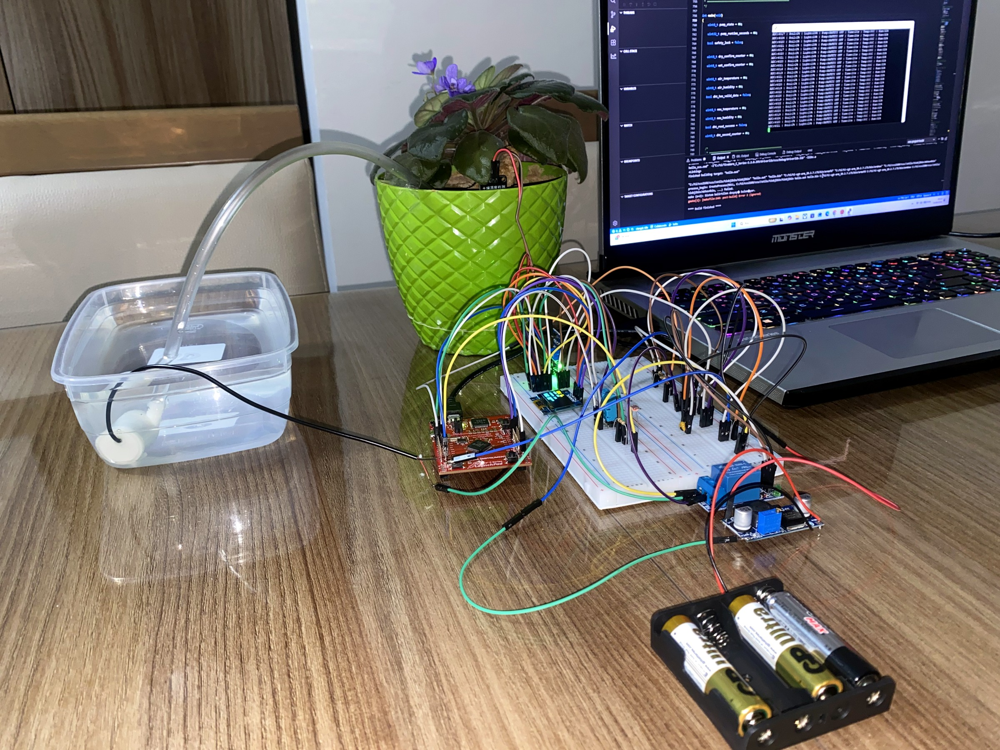
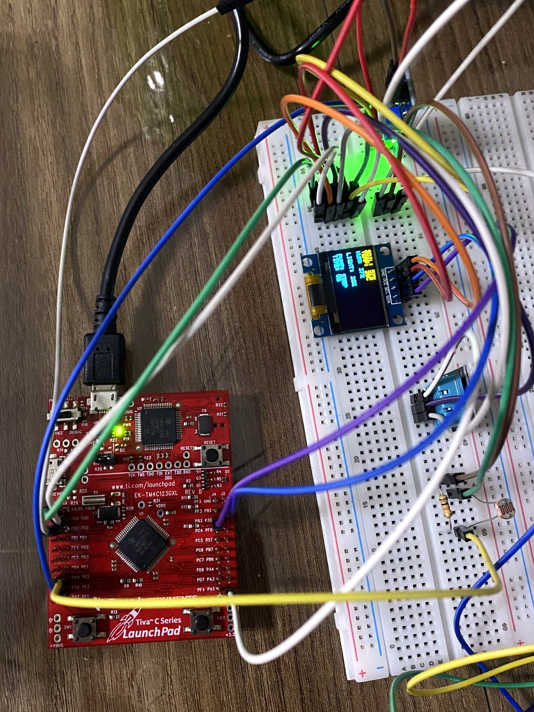
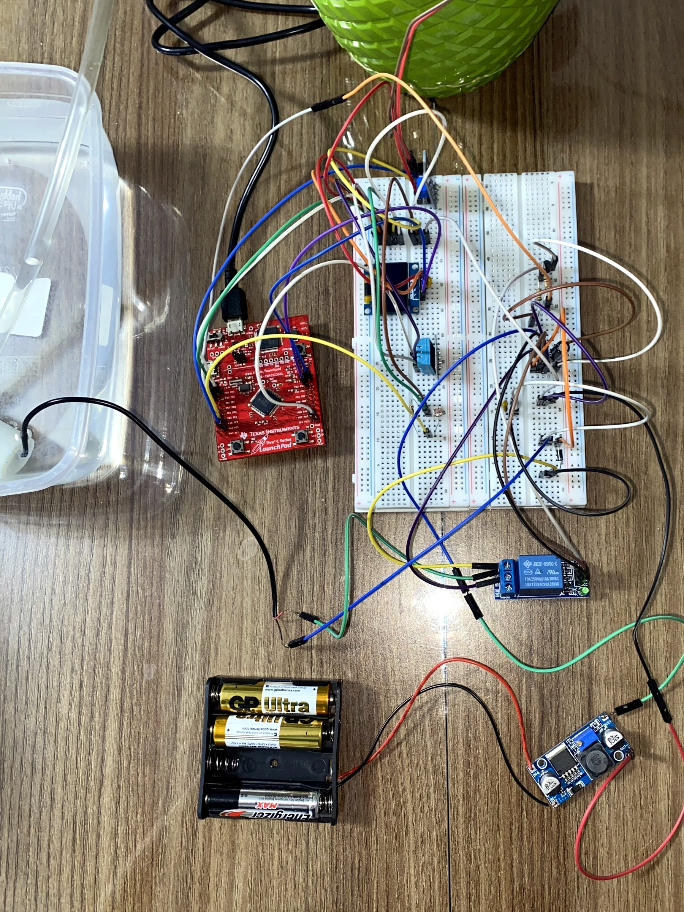
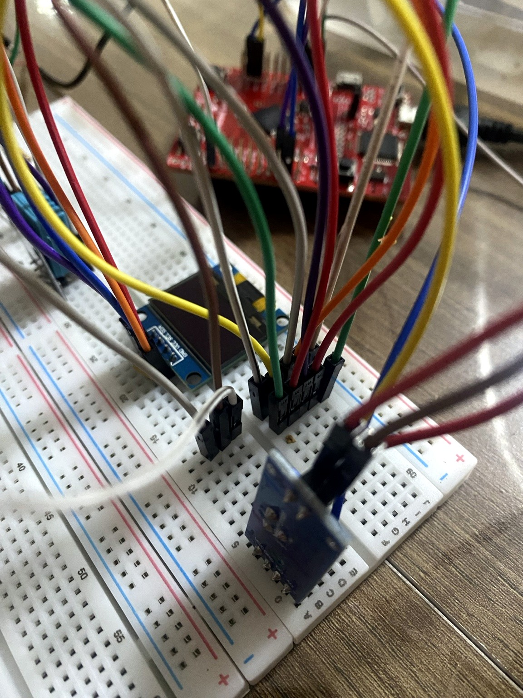
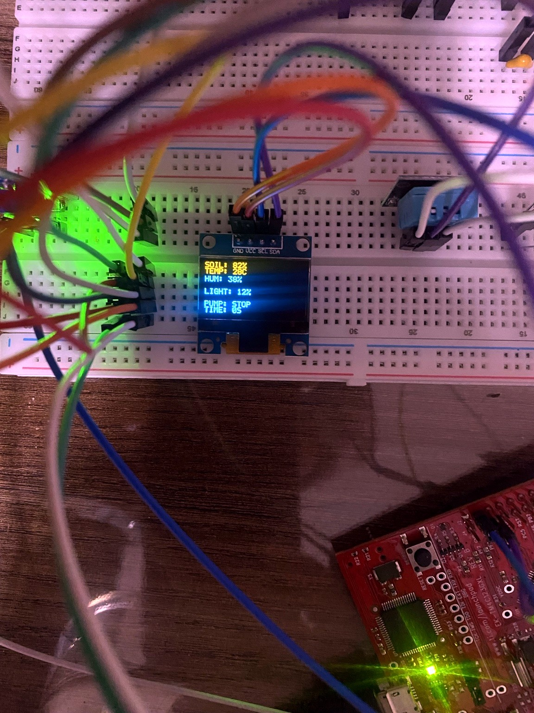
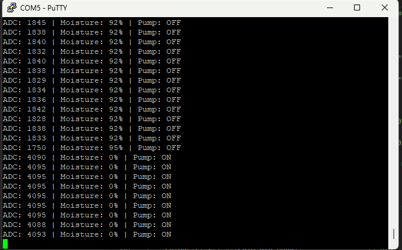
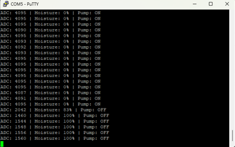

# TM4C123 Smart Irrigation System

An embedded smart irrigation controller built around the Texas Instruments **EK-TM4C123GXL Tiva C LaunchPad**. The system measures soil moisture, ambient light, temperature, and humidity, presents live status on an SSD1306 OLED and UART, and controls a DC water pump through a transistor-driven relay stage.

The final prototype combines sensor calibration, 16-sample ADC averaging, hysteresis, consecutive-sample confirmation, a 20-second pump safety timeout, SW1 manual START/STOP control, and hardware changes introduced to reduce motor-generated electrical interference.

## Final System



### Project links

- **Final source:** [`source/main.c`](source/main.c)
- **Importable CCS project:** [`firmware/irrigation_system/`](firmware/irrigation_system/)
- **Project report:** [`docs/project-report.md`](docs/project-report.md)
- **Hardware connections:** [`docs/hardware-connections.md`](docs/hardware-connections.md)
- **Troubleshooting record:** [`docs/troubleshooting.md`](docs/troubleshooting.md)
- **Test results:** [`docs/test-results.md`](docs/test-results.md)
- **Build and run guide:** [`docs/build-and-run.md`](docs/build-and-run.md)
- **Media evidence index:** [`docs/media-evidence.md`](docs/media-evidence.md)

## Video Demonstrations

The repository contains optimized H.264/MP4 copies of the original 4K validation recordings.

- **[Final irrigation demonstration](videos/final-demo/01-final-irrigation-demo.mp4)**
- [Soil-moisture / water test](videos/subsystem-tests/01-soil-moisture-water-test.mp4)
- [OLED and sensor subsystem test](videos/subsystem-tests/02-oled-sensor-subsystem-test.mp4)
- [Relay-driver switching test](videos/subsystem-tests/03-relay-driver-switching-test.mp4)
- [Pump and display integration test](videos/subsystem-tests/04-pump-display-integration-test.mp4)
- [Sensitive-subsystem soil test](videos/subsystem-tests/05-sensitive-subsystem-soil-test.mp4)
- [Integrated system control test](videos/subsystem-tests/06-integrated-system-control-test.mp4)

## Main Features

- EK-TM4C123GXL / TM4C123GH6PM based control
- Soil moisture measurement through ADC0 / AIN0
- LDR-based ambient light measurement through ADC0 / AIN1
- DHT11 temperature and humidity sensing
- SSD1306 OLED over I2C0
- UART0 monitoring at 115200 8N1
- Relay-controlled DC water pump
- BC337 transistor relay-input driver
- 16-sample ADC averaging
- 35% irrigation start threshold
- 50% irrigation stop threshold
- 3-sample dry confirmation
- 3-sample wet confirmation
- 20-second maximum pump runtime safety limit
- SW1-based manual START/STOP control
- Motor-noise suppression and power decoupling
- Physically separated sensitive-electronics and power subsystems

## System Architecture

The final hardware is separated into two functional subsystems.

### Sensitive Electronics Subsystem

- EK-TM4C123GXL LaunchPad
- SSD1306 OLED
- DHT11
- Soil moisture sensor
- LDR + 10 kΩ voltage divider



### Power and Pump Subsystem

- LM2596 buck converter
- BC337 transistor
- 1 kΩ base resistor
- 10 kΩ relay-input pull-up resistor
- Relay module
- DC water pump
- 1N4007 diode
- 100 nF ceramic capacitor
- 470 µF electrolytic capacitor



The two subsystems share the required control signal and electrical reference:

```text
Tiva PB0 --------------------> BC337 base-driver path
Tiva GND --------------------> LM2596 OUT- / power-side ground
```

This layout was adopted after motor-generated interference caused OLED corruption, DHT11 failures, and unstable analog readings in the earlier combined breadboard arrangement.

## Pin Connections

| Function | Tiva C Pin | External Connection |
|---|---|---|
| UART0 RX | PA0 | Stellaris Virtual Serial Port |
| UART0 TX | PA1 | Stellaris Virtual Serial Port |
| DHT11 data | PA2 | DHT11 S |
| Soil ADC | PE3 / AIN0 | Soil sensor AO |
| LDR ADC | PE2 / AIN1 | LDR voltage-divider midpoint |
| Relay control | PB0 | 1 kΩ -> BC337 Base |
| OLED SCL | PB2 / I2C0SCL | SSD1306 SCL |
| OLED SDA | PB3 / I2C0SDA | SSD1306 SDA |
| User switch | PF4 / SW1 | Manual START/STOP |

Full wiring details are documented in [`docs/hardware-connections.md`](docs/hardware-connections.md).

## Sensor Calibration

### Soil moisture

The soil sensor analog output is connected to PE3/AIN0.

```c
#define SOIL_DRY_VALUE 4090U
#define SOIL_WET_VALUE 1650U
```

Values outside the calibrated interval are clamped so the displayed moisture value remains between 0% and 100%.

### LDR voltage divider

```text
3.3 V
  |
 LDR
  |
  +--------> PE2 / AIN1
  |
 10 kΩ
  |
 GND
```

The ADC value is averaged and mapped to the calibrated light-percentage range used by the display and UART output.

## Automatic Irrigation Logic

The irrigation controller does **not** enable automatic watering at power-up. Monitoring starts immediately, but the pump remains disabled until SW1 is pressed.

```text
Power ON
   |
   v
System STOP
   |
SW1 pressed
   |
   v
Automation enabled
   |
   +-- Soil < 35% for 3 consecutive samples --> Pump ON
   |
   +-- Soil > 50% for 3 consecutive samples --> Pump OFF
   |
   +-- Pump runtime reaches 20 s -------------> SAFETY OFF
```

The 35% / 50% thresholds form a hysteresis band. Consecutive-sample confirmation was added so isolated ADC disturbances cannot immediately change the pump state.

## Pump Driver and Power Path

The TM4C123 GPIO does not drive the pump or relay input directly. PB0 controls a BC337 transistor interface.

```text
Tiva PB0
   |
  1 kΩ
   |
BC337 Base

LM2596 OUT+ ---- 10 kΩ ----+---- Relay IN
                           |
                     BC337 Collector

BC337 Emitter ------------ LM2596 OUT-
```

Logical behavior:

```text
PB0 LOW  -> Relay OFF
PB0 HIGH -> Relay ON
```

Pump contact wiring:

```text
LM2596 OUT+ -> Relay COM
Relay NO    -> Pump +
Pump -      -> LM2596 OUT-
```

Using the normally-open contact keeps the pump disconnected when the relay is inactive.

## EMI and Noise Mitigation

Motor integration initially produced OLED corruption, DHT11 read failures, ADC spikes, and occasional display freezes. The final prototype combines several countermeasures:

- 1N4007 diode across the pump line, reverse-biased during normal operation
- 100 nF ceramic capacitor across the motor terminals
- 470 µF electrolytic capacitor across LM2596 OUT+ / OUT-
- physical separation of sensitive and high-current circuitry
- a controlled common-ground connection between subsystems
- 16-sample ADC averaging
- 3-sample wet/dry confirmation
- DHT11 reads deferred while the pump is running



The complete failure history and the reasoning behind each correction are recorded in [`docs/troubleshooting.md`](docs/troubleshooting.md).

## OLED and UART Verification

Final OLED STOP-state example:



The same controller state is transmitted over UART for independent verification.

Example format:

```text
ADC:2695 | Soil:57% | Light:23% | System:RUN | Pump:OFF | Time:0s | Temp:29C | Hum:32%
```

### Dry-start evidence



### Normal wet-stop evidence



These logs demonstrate the normal closed-loop sequence: a dry condition enables irrigation, measured moisture rises, and the pump returns to OFF after the wet condition is confirmed. Safety-timeout evidence is retained separately under `images/uart/` and `images/troubleshooting/`.

## Safety Features

- Pump output forced OFF at startup
- Automation requires an SW1 press
- Three consecutive dry measurements required before pump start
- Three consecutive wet measurements required before normal pump stop
- 20-second maximum continuous pump runtime
- Safety state prevents immediate restart after timeout
- Second SW1 press immediately disables the pump and resets controller state
- Relay NO contact provides a default-open pump path

## Development and Troubleshooting Highlights

Development exposed several hardware/software integration problems, including:

- incorrect early pump/relay contact wiring
- 3.3 V / relay-input interface problems
- BC337 driver wiring errors
- DHT11 timing/read failures
- OLED display corruption during pump operation
- soil ADC spikes caused by motor interference
- unstable pump decisions caused by transient readings
- duplicated source code causing repeated function definitions and multiple `main()` errors
- ineffective software-only I2C recovery attempts
- complex return-current / ground paths in the original breadboard layout

The full chronological record is in [`docs/troubleshooting.md`](docs/troubleshooting.md) and [`docs/development-log.md`](docs/development-log.md).

## Repository Structure

```text
TM4C123-Smart-Irrigation-System/
├── firmware/
│   └── irrigation_system/        # Importable Code Composer Studio project
├── source/
│   └── main.c                    # Final readable application source
├── docs/
│   ├── build-and-run.md
│   ├── development-log.md
│   ├── hardware-connections.md
│   ├── media-evidence.md
│   ├── project-report.md
│   ├── test-results.md
│   ├── troubleshooting.md
│   └── user-manual.md
├── images/
│   ├── components/
│   ├── dht11/
│   ├── final-system/
│   ├── ldr/
│   ├── oled/
│   ├── power-subsystem/
│   ├── pump/
│   ├── relay-driver/
│   ├── sensitive-subsystem/
│   ├── soil-sensor/
│   ├── troubleshooting/
│   └── uart/
├── videos/
│   ├── subsystem-tests/
│   └── final-demo/
├── .gitignore
├── CHANGELOG.md
├── LICENSE
├── README.md
└── THIRD_PARTY_NOTICES.md
```

## Development Environment

The prototype was developed with:

- Code Composer Studio
- TivaWare for C Series 2.2.0.295
- TI ARM Compiler 20.2.7.LTS
- Stellaris ICDI debug interface
- PuTTY or another serial terminal

See [`docs/build-and-run.md`](docs/build-and-run.md) for repository import, build, flash, and serial-monitor instructions.

## UART Configuration

```text
Baud rate:    115200
Data bits:    8
Parity:       None
Stop bits:    1
Flow control: None
```

## Final Status

The final prototype demonstrates closed-loop irrigation with live environmental monitoring. The OLED and UART remain available for observation while the pump is controlled according to calibrated soil moisture, hysteresis, confirmation counters, operator enable state, and maximum-runtime safety protection.

The readable source and the CCS project contain the same final application code.

## License

Original project source code and documentation are released under the MIT License. Texas Instruments-provided or TivaWare-derived files retain their original license notices and terms. See [`THIRD_PARTY_NOTICES.md`](THIRD_PARTY_NOTICES.md) for details.
