# TM4C123 Smart Irrigation System

A closed-loop irrigation controller built around the Texas Instruments **EK-TM4C123GXL Tiva C LaunchPad**. The system measures soil moisture, ambient light, temperature, and humidity; displays live status on an SSD1306 OLED; streams diagnostics over UART; and controls a DC water pump through a BC337-driven relay stage.

This repository records the complete build process, including the failures that appeared when the motor was integrated and the changes that were required to make the final prototype stable.

<p align="center">
  
</p>

## Final Demo

GitHub's normal repository file viewer does not reliably preview a committed MP4 of this size. The links below therefore open the **raw MP4 directly**, bypassing the large-file preview page.

### [▶ Open Final Irrigation Demonstration](https://raw.githubusercontent.com/YigitalpDellal/TM4C123-Smart-Irrigation-System/main/videos/final-demo/01-final-irrigation-demo.mp4)

<p align="center">
<a href="https://raw.githubusercontent.com/YigitalpDellal/TM4C123-Smart-Irrigation-System/main/videos/final-demo/01-final-irrigation-demo.mp4">
  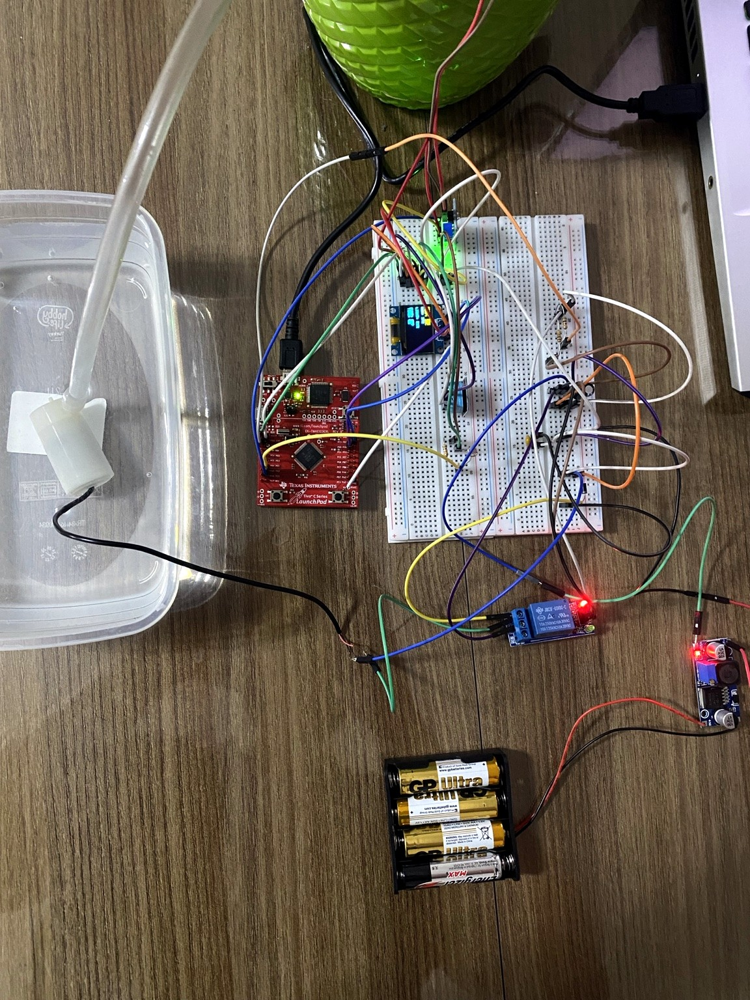
</a>
</p>

**Click either the title link or the preview image above.** The browser receives the MP4 directly instead of opening GitHub's repository file-preview page. Depending on browser settings, it may play in the browser's native video player or download the file.

---

## 1. System Overview

The controller continuously monitors:

- soil moisture through **PE3 / AIN0**
- ambient light through **PE2 / AIN1**
- temperature and humidity through a **DHT11 on PA2**
- operator START/STOP input through **SW1 / PF4**

It reports the current state through:

- an **SSD1306 OLED over I2C0**
- **UART0 at 115200 8N1**

When automatic control is enabled with SW1, the controller evaluates the soil reading and decides whether the pump should run.

```text
Power ON
   |
   v
System STOP
Sensors + OLED + UART active
Pump forced OFF
   |
SW1 pressed
   |
   v
System RUN
   |
   +-- Soil < 35% for 3 consecutive samples --> Pump ON
   |
   +-- Soil > 50% for 3 consecutive samples --> Pump OFF
   |
   +-- Pump reaches 20 s runtime -------------> SAFETY OFF
   |
Second SW1 press
   |
   v
System STOP + Pump OFF + state reset
```

The separate 35% start and 50% stop thresholds provide hysteresis. The three-sample confirmation requirement prevents one disturbed measurement from immediately changing the pump state.

---

## 2. Repository Guide

| Resource | Purpose |
|---|---|
| [`source/main.c`](source/main.c) | Final readable application source |
| [`firmware/irrigation_system/`](firmware/irrigation_system/) | Importable Code Composer Studio project |
| [`docs/project-report.md`](docs/project-report.md) | Full engineering report |
| [`docs/hardware-connections.md`](docs/hardware-connections.md) | Final verified wiring and power setup |
| [`docs/build-and-run.md`](docs/build-and-run.md) | CCS import, build, flash, and UART setup |
| [`docs/test-results.md`](docs/test-results.md) | Final verification results |
| [`docs/troubleshooting.md`](docs/troubleshooting.md) | Detailed failure and correction history |
| [`docs/troubleshooting-audit.md`](docs/troubleshooting-audit.md) | Troubleshooting coverage audit |
| [`docs/development-log.md`](docs/development-log.md) | Chronological development progression |
| [`docs/user-manual.md`](docs/user-manual.md) | Operating instructions |
| [`docs/media-evidence.md`](docs/media-evidence.md) | Engineering claim-to-media mapping |
| [`docs/media-inventory.md`](docs/media-inventory.md) | Complete image and video archive index |

---

## 3. Hardware

### Controller and sensors

- EK-TM4C123GXL LaunchPad / TM4C123GH6PM
- resistive soil-moisture probe and analog interface module
- LDR photoresistor + 10 kΩ divider resistor
- DHT11 temperature/humidity sensor
- SSD1306 I2C OLED

### Pump and power stage

- four-cell AA battery holder
- LM2596 buck converter
- BC337 NPN transistor
- 1 kΩ base resistor
- 10 kΩ relay-input pull-up resistor
- relay module
- DC water pump
- 1N4007 diode
- 100 nF ceramic capacitor
- 470 µF electrolytic capacitor

<p align="center">
  
  
</p>

The final prototype uses two physical subsystems because motor current and switching noise repeatedly disturbed the OLED, DHT11, and analog measurements when everything was accumulated on the earlier shared breadboard layout.

---

## 4. Pin Assignment

| Function | TM4C123 pin | External connection |
|---|---|---|
| UART0 RX | PA0 | Stellaris Virtual Serial Port |
| UART0 TX | PA1 | Stellaris Virtual Serial Port |
| DHT11 data | PA2 | DHT11 S |
| Relay control | PB0 | 1 kΩ → BC337 Base |
| OLED SCL | PB2 / I2C0SCL | SSD1306 SCL |
| OLED SDA | PB3 / I2C0SDA | SSD1306 SDA |
| LDR analog input | PE2 / AIN1 | LDR divider midpoint |
| Soil analog input | PE3 / AIN0 | Soil sensor AO |
| User switch | PF4 / SW1 | Manual START/STOP |

---

# 5. Hardware Build

The project is much easier to reproduce if each subsystem is verified before the next one is added.

## 5.1 Sensitive electronics

### OLED

```text
OLED GND -> Tiva GND
OLED VCC -> Tiva 3.3 V
OLED SCL -> PB2 / I2C0SCL
OLED SDA -> PB3 / I2C0SDA
```

Firmware address:

```c
#define OLED_ADDRESS 0x3CU
```

<p align="center">
  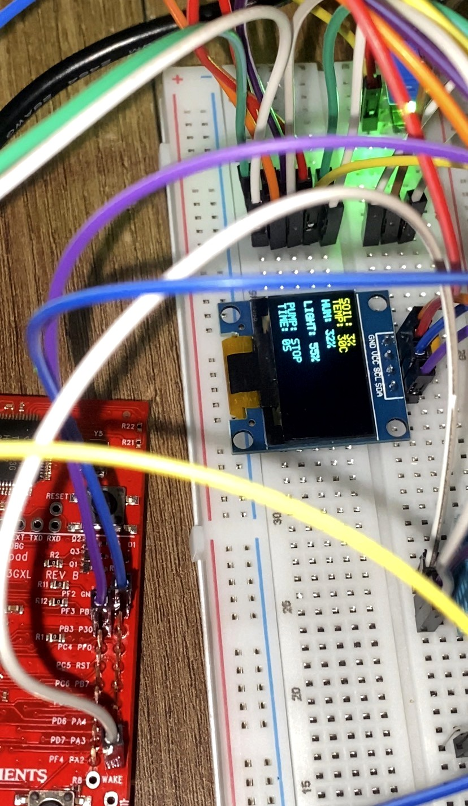
</p>

### DHT11

```text
DHT11 S -> PA2
DHT11 + -> Tiva 3.3 V
DHT11 - -> Tiva GND
```

### Soil sensor

```text
Soil VCC -> Tiva 3.3 V
Soil GND -> Tiva GND
Soil AO  -> PE3 / AIN0
Soil DO  -> not connected
```

Only the analog output is used.

<p align="center">
  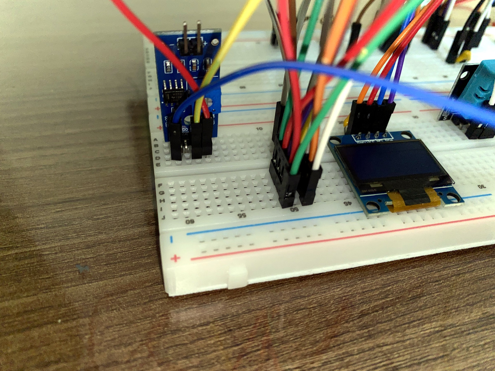
  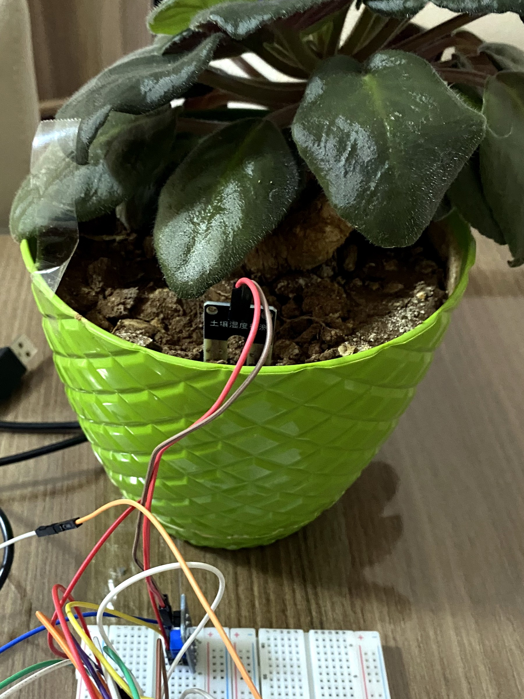
</p>

### LDR divider

```text
Tiva 3.3 V
   |
  LDR
   |
   +--------> PE2 / AIN1
   |
 10 kΩ
   |
  GND
```

The LDR, PE2 jumper, and one side of the 10 kΩ resistor meet at the same midpoint node.

## 5.2 Set the LM2596 output before connecting the power stage

The relay/pump side is supplied from a four-cell AA battery pack through the LM2596 buck converter.

The regulator was not connected to the rest of the power stage with an unknown output setting. The supply was checked first with a digital multimeter:

1. The four-cell AA battery pack was measured at approximately **5.72 V**.
2. The pack was connected to the LM2596 input.
3. The multimeter was connected across LM2596 OUT+ and OUT-.
4. The onboard adjustment potentiometer was turned while watching the meter.
5. Adjustment stopped when the converter output reached **5.00 V**.
6. Only after that measurement was the relay/pump circuitry connected.

```text
4 x AA battery pack (~5.72 V measured)
              |
              v
         LM2596 input
              |
        buck conversion
              |
        +-----+-----+
        |           |
      OUT+         OUT-
      5.00 V       GND
```

<p align="center">
  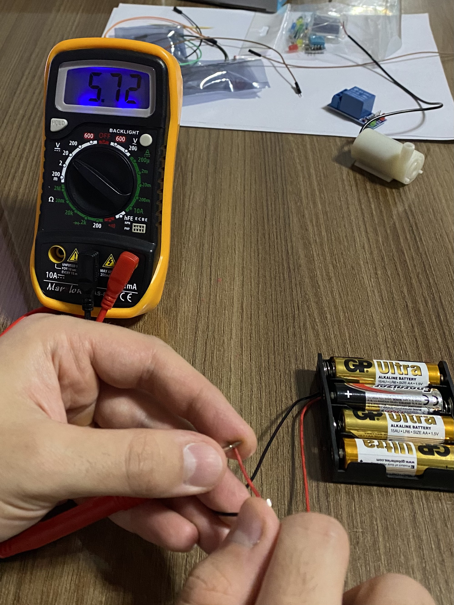
  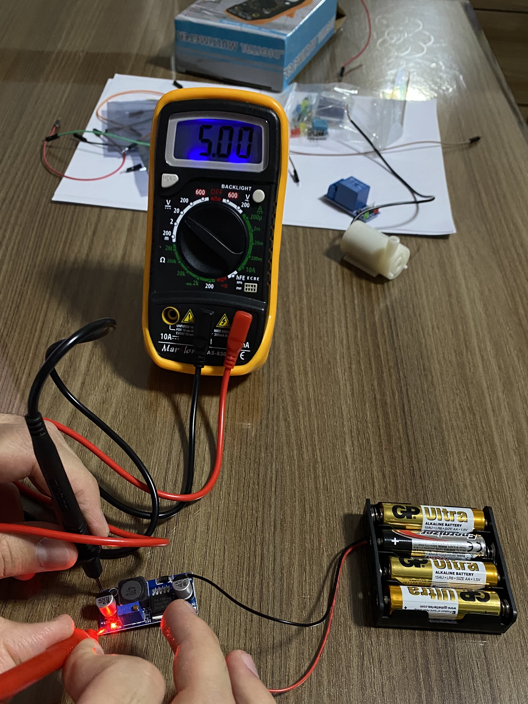
</p>

This measurement matters because it removes the supply voltage as an unknown during relay and motor debugging. The 5 V rail was measured, not assumed.

## 5.3 BC337 relay driver

The relay input is controlled through a BC337 transistor stage:

```text
PB0 -> 1 kΩ -> BC337 Base
BC337 Emitter -> LM2596 OUT-
BC337 Collector -> Relay IN
LM2596 OUT+ -> 10 kΩ -> Relay IN / Collector node
```

Relay supply:

```text
Relay VCC -> LM2596 OUT+
Relay GND -> LM2596 OUT-
Relay IN  -> BC337 Collector node
```

The 1 kΩ resistor limits base current. The 10 kΩ resistor provides the relay-input pull-up used in the final arrangement.

<p align="center">
  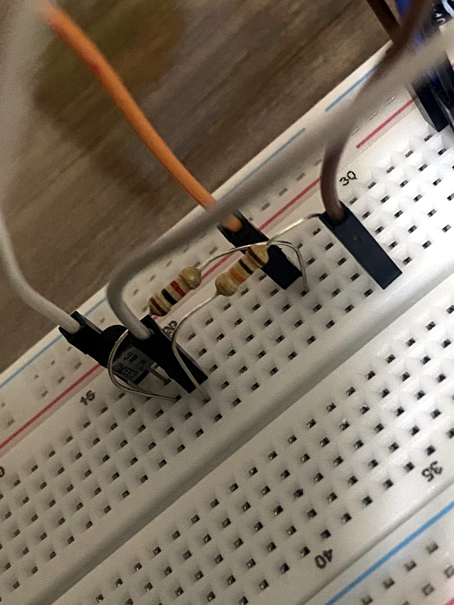
</p>

The relay should be tested repeatedly before the pump is attached. Verify both the status LED/mechanical click and that the transistor does not show abnormal heating.

## 5.4 Pump contact wiring

```text
LM2596 OUT+ -> Relay COM
Relay NO    -> Pump +
Pump -      -> LM2596 OUT-
```

The normally-open contact keeps the pump power path open while the relay is inactive.

## 5.5 Motor-noise suppression

### 1N4007 diode

```text
Striped end     -> Pump + / Relay NO side
Non-striped end -> Pump - / LM2596 OUT-
```

### 100 nF ceramic capacitor

```text
Pump + ---- 100 nF ---- Pump -
```

### 470 µF electrolytic capacitor

```text
470 µF + -> LM2596 OUT+
470 µF - -> LM2596 OUT-
```

<p align="center">
  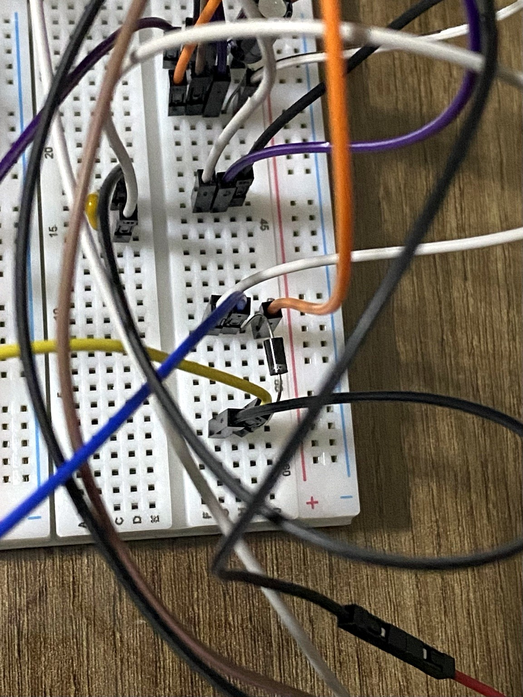
  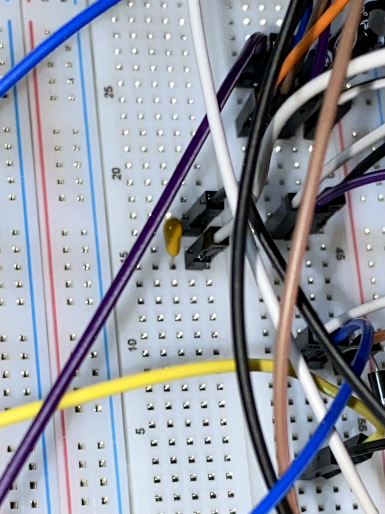
  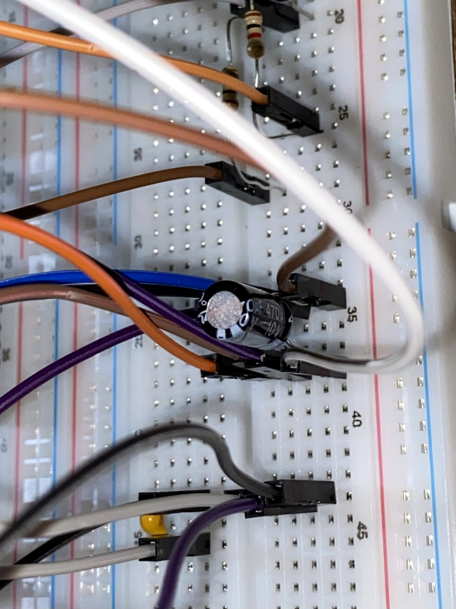
</p>

## 5.6 Common reference between subsystems

The sensitive side and power side need a common electrical reference for PB0:

```text
Tiva GND -> LM2596 OUT-
```

The final rebuild avoids multiple unnecessary ground bridges between the breadboards.

<p align="center">
  
</p>

## 5.7 Power-up checklist

Before applying power:

- verify the battery holder goes to the LM2596 input, not directly to the regulated 5 V nodes
- measure LM2596 output and confirm approximately 5.00 V
- check for a short between OUT+ and OUT-
- check the 470 µF capacitor polarity
- check the 1N4007 stripe orientation
- use relay COM and NO, not NC
- check pump polarity
- confirm PB0 reaches the BC337 base only through 1 kΩ
- confirm OUT+ reaches Relay IN only through 10 kΩ
- keep one deliberate common reference between Tiva GND and LM2596 OUT-
- keep OLED and sensors on the Tiva 3.3 V side

---

# 6. Firmware Architecture

The readable application source is [`source/main.c`](source/main.c). The CCS project retains its tested application filename `hello.c`; both contain the same final application code.

## 6.1 Main constants

```c
#define MOISTURE_LOW_THRESHOLD    35U
#define MOISTURE_HIGH_THRESHOLD   50U
#define MAX_PUMP_RUNTIME          20U
#define ADC_SAMPLE_COUNT          16U
#define DRY_CONFIRM_COUNT          3U
#define WET_CONFIRM_COUNT          3U
#define SOIL_DRY_VALUE          4090U
#define SOIL_WET_VALUE          1650U
#define DHT_READ_INTERVAL_SECONDS  2U
#define DHT_MAX_RETRIES            3U
```

## 6.2 Timer and main-loop split

Timer0A generates the one-second timing event. Its interrupt handler clears the interrupt and raises a flag. Sensor acquisition, UART output, display updates, and pump decisions remain in the main execution context instead of being performed inside the ISR.

## 6.3 ADC acquisition

ADC0 sequencer 2 samples:

```text
Sample 0 -> Soil sensor, PE3 / AIN0
Sample 1 -> LDR divider,  PE2 / AIN1
```

The firmware performs **16 conversions** and averages both channels before converting them to percentages.

## 6.4 Soil calibration

```c
#define SOIL_DRY_VALUE 4090U
#define SOIL_WET_VALUE 1650U
```

```text
ADC >= 4090 -> 0%
ADC <= 1650 -> 100%
Intermediate values -> linear calibrated percentage
```

Values beyond the calibrated endpoints are clamped to 0–100%.

## 6.5 Irrigation decision logic

Dry condition:

```text
Soil < 35%
```

Three consecutive dry samples are required before pump start.

Wet condition:

```text
Soil > 50%
```

Three consecutive wet samples are required before normal pump stop.

Inside the 35–50% hysteresis band, neither confirmation counter is allowed to accumulate.

## 6.6 Safety timeout

The 20-second limit is a backup safety mechanism, not the normal target stop.

```text
Normal stop -> 3 confirmed measurements above 50%
Safety stop -> pump continuously active for 20 s
```

After a safety timeout, the pump remains off until the controller state is reset.

## 6.7 DHT11 handling

The DHT11 is timing-sensitive. Pump operation caused transient invalid reads during development, so the final firmware:

- retries failed DHT11 transactions
- retains the most recent valid temperature/humidity values
- avoids starting a new DHT11 read while the pump is running
- reads DHT11 less frequently than the analog channels

## 6.8 SW1 control

PF4 uses the LaunchPad SW1 internal pull-up:

```text
Released -> HIGH
Pressed  -> LOW
```

```text
Power-up     -> STOP, pump OFF
First press  -> RUN, automatic control enabled
Second press -> STOP, pump OFF, counters/runtime/safety reset
```

Sensor monitoring, OLED updates, and UART output remain active in STOP mode.

---

# 7. OLED and UART

The OLED displays:

```text
SOIL
TEMP
HUM
LIGHT
PUMP
TIME
```

State labels include:

```text
STOP
OFF
ON
SAFETY
```

<p align="center">
  
</p>

UART configuration:

```text
115200 baud
8 data bits
no parity
1 stop bit
no flow control
```

Example:

```text
ADC:2695 | Soil:57% | Light:23% | System:RUN | Pump:OFF | Time:0s | Temp:29C | Hum:32%
```

UART became the main diagnostic reference during development because it kept exposing controller state even when the OLED itself was corrupted or frozen.

---

# 8. Problems Encountered and Corrections

The final design was shaped by failures observed during real hardware integration.

| # | Problem / symptom | Cause or diagnostic conclusion | Correction | Verification |
|---|---|---|---|---|
| 1 | Soil ADC values did not translate into a meaningful percentage | Generic ADC mapping did not match the physical probe | Measured dry/wet endpoints: 4090 / 1650 | Dry, intermediate, and wet UART tests |
| 2 | Pump decision was unstable around one threshold | No hysteresis | 35% start and 50% stop thresholds | Stable transition band |
| 3 | Relay did not behave reliably from the original GPIO arrangement | Relay input needed a controlled interface | Added BC337, 1 kΩ, and 10 kΩ stage | Repeated relay switching |
| 4 | Early BC337 tests failed and transistor behavior was abnormal | Incorrect transistor/resistor node wiring | Rebuilt base/collector/emitter topology | Relay switched without abnormal heating |
| 5 | Relay clicked but pump was silent or default behavior was wrong | Incorrect relay contact wiring | OUT+ → COM, NO → Pump+, Pump- → OUT- | Pump followed relay state |
| 6 | Runtime timeout was being treated like the normal irrigation stop | Normal and emergency termination were not separated | Wet confirmation became normal stop; timeout became fail-safe | UART distinguishes OFF and SAFETY OFF |
| 7 | Initial 10 s safety limit was too short | Bench-test value did not allow enough wetting time | Increased to 20 s | Longer watering with retained protection |
| 8 | Pump stopped/restarted after sudden soil jumps | Motor noise disturbed ADC measurements | 16-sample averaging + 3-sample confirmation | Single spikes no longer changed pump state |
| 9 | OLED text corrupted during pump operation | Motor switching disturbed the sensitive I2C/power environment | Added suppression/filtering, simplified ground paths, separated subsystems | Stable final OLED operation |
| 10 | DHT11 produced invalid readings around pump operation | Timing-sensitive protocol was vulnerable to disturbance | Retries, last-valid retention, no new DHT read while pump is ON | More stable final temperature/humidity output |
| 11 | OLED froze while UART continued updating | MCU was still running; fault was localized to OLED/I2C/power conditions | Used UART to isolate the failure, then corrected hardware/layout | OLED resumed continuous updates after rebuild |
| 12 | Automatic I2C/OLED recovery made behavior worse or did not help | Root cause was primarily electrical | Removed the recovery experiment | Simpler I2C code worked after hardware correction |
| 13 | Some OLED labels had missing characters | Custom font did not contain every intermediate label character | Restricted/extended the glyph set | Final labels render correctly |
| 14 | CCS produced duplicate-function and multiple-main errors | Full source implementation had accidentally been pasted twice | Removed duplicated source half | Duplicate-definition errors disappeared |
| 15 | One syntax issue caused a large compiler error cascade | Parser context was already lost | Corrected earliest syntax/context error first | Build diagnostics returned to meaningful errors |
| 16 | OLED behavior changed when redundant grounds were removed | Return-current paths had become mixed and uncontrolled | Simplified grounding and retained one deliberate shared reference | Significant stability improvement |
| 17 | Incremental breadboard became too complex to diagnose | Too many accumulated jumper and return paths | Rebuilt as sensitive and power breadboards | Stable integrated operation |
| 18 | Irrigation started immediately at power-up | No explicit operator enable state | Added SW1 START/STOP behavior | Controlled, repeatable demonstrations |
| 19 | A subsystem test alone could not prove final reliability | Several failures appeared only during interaction | Added full integrated verification sequence | Final system passed integrated test |

### Failure evidence

<p align="center">
  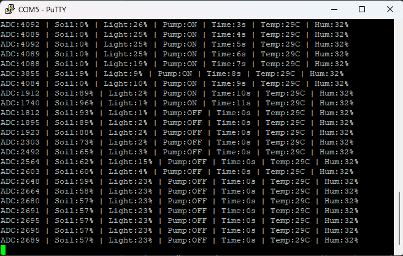
  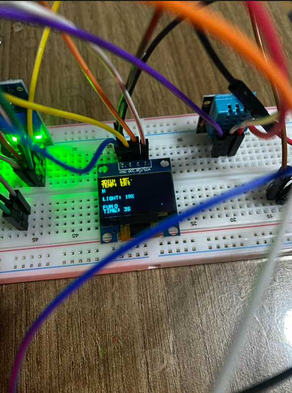
  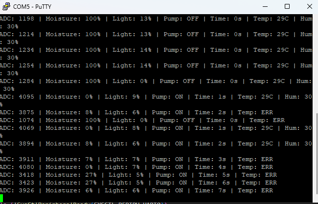
</p>

Detailed chronology: [`docs/troubleshooting.md`](docs/troubleshooting.md)

Coverage audit: [`docs/troubleshooting-audit.md`](docs/troubleshooting-audit.md)

---

# 9. Final Verification

| Test | Result |
|---|---|
| Battery pack measured before regulation | Passed, ~5.72 V |
| LM2596 adjusted and measured | Passed, 5.00 V |
| UART communication | Passed |
| OLED initialization and live refresh | Passed |
| DHT11 temperature/humidity | Passed |
| DHT retry and last-valid handling | Passed |
| Soil ADC and calibrated percentage | Passed |
| LDR ADC and light percentage | Passed |
| 16-sample ADC averaging | Passed |
| BC337 relay driver | Passed |
| Relay default-open pump path | Passed |
| Pump ON/OFF operation | Passed |
| Three-sample dry confirmation | Passed |
| Three-sample wet confirmation | Passed |
| 35% / 50% hysteresis | Passed |
| 20-second safety timeout | Passed |
| SW1 startup STOP state | Passed |
| SW1 RUN / STOP-reset behavior | Passed |
| Motor-noise mitigation | Passed |
| Two-subsystem integration | Passed |
| Common-ground reference | Passed |
| Real-soil irrigation response | Passed |

### Dry condition accepted → pump ON

<p align="center">
  
</p>

### Moisture rises → confirmed wet condition → pump OFF

<p align="center">
  
</p>

### Safety fallback

<p align="center">
  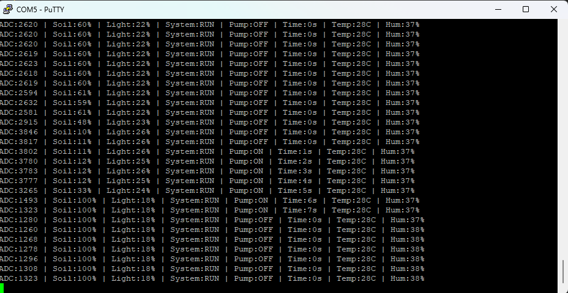
</p>

---

# 10. Additional Video Tests

- [Soil-moisture / water test](https://raw.githubusercontent.com/YigitalpDellal/TM4C123-Smart-Irrigation-System/main/videos/subsystem-tests/01-soil-moisture-water-test.mp4)
- [OLED and sensor subsystem test](https://raw.githubusercontent.com/YigitalpDellal/TM4C123-Smart-Irrigation-System/main/videos/subsystem-tests/02-oled-sensor-subsystem-test.mp4)
- [Relay-driver switching test](https://raw.githubusercontent.com/YigitalpDellal/TM4C123-Smart-Irrigation-System/main/videos/subsystem-tests/03-relay-driver-switching-test.mp4)
- [Pump and display integration test](https://raw.githubusercontent.com/YigitalpDellal/TM4C123-Smart-Irrigation-System/main/videos/subsystem-tests/04-pump-display-integration-test.mp4)
- [Sensitive-subsystem soil test](https://raw.githubusercontent.com/YigitalpDellal/TM4C123-Smart-Irrigation-System/main/videos/subsystem-tests/05-sensitive-subsystem-soil-test.mp4)
- [Integrated system control test](https://raw.githubusercontent.com/YigitalpDellal/TM4C123-Smart-Irrigation-System/main/videos/subsystem-tests/06-integrated-system-control-test.mp4)

The primary final demonstration is available through the [direct MP4 link](https://raw.githubusercontent.com/YigitalpDellal/TM4C123-Smart-Irrigation-System/main/videos/final-demo/01-final-irrigation-demo.mp4).

---

# 11. Build and Run

Development environment:

- Code Composer Studio
- TivaWare for C Series 2.2.0.295
- TI ARM Compiler 20.2.7.LTS
- Stellaris ICDI debug interface
- PuTTY or another serial terminal

Original TivaWare path used during development:

```text
C:/ti/TivaWare_C_Series-2.2.0.295/
```

If TivaWare is installed elsewhere, update the CCS include/library paths.

Import the project from:

```text
firmware/irrigation_system/
```

Full instructions: [`docs/build-and-run.md`](docs/build-and-run.md)

---

# 12. Recommended Reproduction Order

1. LaunchPad + UART
2. OLED
3. DHT11
4. LDR
5. Soil sensor and calibration
6. Battery pack voltage measurement
7. LM2596 adjustment to 5.00 V
8. BC337/relay test without pump
9. Relay COM/NO pump path
10. 1N4007, 100 nF, and 470 µF suppression/filtering
11. Common reference between subsystems
12. Dry confirmation test
13. Wet confirmation test
14. Safety timeout test
15. SW1 START/STOP test
16. Full motor/noise test while watching OLED and UART
17. Real-soil closed-loop irrigation test

---

# 13. Why the Final Design Looks This Way

| Design choice | Reason |
|---|---|
| LM2596 adjusted to measured 5.00 V | Keeps the power-side supply known and repeatable |
| 35% start / 50% stop | Prevents threshold chatter |
| Three consecutive samples | Rejects isolated ADC disturbances |
| 16-sample ADC averaging | Reduces short analog spikes |
| BC337 relay interface | Provides a controlled PB0-to-relay interface |
| Relay NO contact | Keeps pump disconnected while relay is inactive |
| 20 s runtime limit | Prevents unlimited pump operation |
| DHT read deferral while pump runs | Avoids timing-sensitive transactions during the noisiest state |
| Last-valid DHT data | Keeps useful values after transient read failure |
| SW1 manual enable | Gives predictable startup and explicit operator control |
| 1N4007 + 100 nF + 470 µF | Reduces motor and supply disturbances |
| Two-breadboard architecture | Separates sensitive electronics from high-current switching |
| One deliberate common reference | Keeps PB0 electrically meaningful without recreating uncontrolled ground paths |
| UART diagnostics | Gives an independent observation path when the OLED fails |

---

# 14. Limitations and Next Steps

The final prototype is still a breadboard demonstrator:

- DHT11 update rate and accuracy are limited.
- Soil calibration depends on the individual probe and soil.
- LDR calibration depends on the lighting environment.
- A resistive soil probe is not ideal for permanent deployment because of corrosion.
- Several firmware operations are blocking.
- Motor/power wiring is breadboard-based rather than a PCB with controlled current return paths.
- There is no historical data logging, wireless connection, water-level sensing, or pump-current fault detection.

Useful next steps would be a capacitive soil sensor, MOSFET pump driver, custom PCB, non-blocking sensor drivers, configurable thresholds, RTC scheduling, data logging, wireless telemetry, water-level sensing, and pump-current monitoring.

---

# 15. Final Engineering Result

The final control chain is:

```text
Soil condition
-> analog voltage
-> ADC sampling
-> 16-sample filtering
-> calibrated moisture percentage
-> hysteresis + confirmation logic
-> PB0
-> BC337 relay driver
-> relay power switching
-> pump operation
-> physical soil wetting
-> new soil measurement
```

At the same time:

```text
DHT11 -> temperature / humidity
LDR   -> ambient-light percentage
OLED  -> local live status
UART  -> independent diagnostics
SW1   -> operator START / STOP
```

The main engineering challenge was not simply switching the pump. Adding a real electromechanical load exposed supply, grounding, analog-measurement, I2C, and timing problems that were not visible in the sensor-only system. The final prototype became stable only after the electrical and software problems were treated together through measured supply setup, filtering, confirmation logic, suppression components, grounding changes, and physical subsystem separation.

For every retained photo and video asset, see [`docs/media-inventory.md`](docs/media-inventory.md).

## License

Original project source code and documentation are released under the MIT License. Texas Instruments-provided or TivaWare-derived files retain their original license notices and terms. See [`THIRD_PARTY_NOTICES.md`](THIRD_PARTY_NOTICES.md) for details.